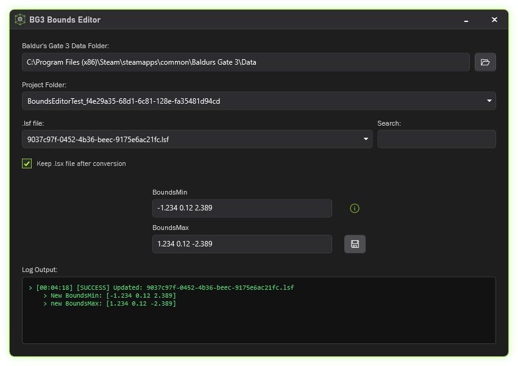

<p align="center">
  <a href="" rel="noopener">
 </a>
</p>

<div align="center">

_A mesh bounds editor for Larian Studios’ Divinity Engine 4.0, developed for Baldur's Gate 3 mod authors._

<picture></picture> <picture></picture> <picture>

</div>

<p><p/>

## :page_with_curl: Features



**BG3 Bounds Editor** is a streamlined interface for modifying mesh bounds in `.lsf` binary files. It utilizes <a href="https://github.com/Norbyte/lslib">**LSLib**</a> to automatically convert a selected `.lsf` to `.xml` (.lsx), apply the necessary changes, then reconvert.

## :scroll: Usage

The **_Baldur's Gate 3 Data Folder_** field requires the default **Data** path of the game.

On Steam, the default data path is: `C:\Program Files (x86)\Steam\steamapps\common\Baldurs Gate 3\Data`  
On GOG, the default data path is: `C:\Program Files (x86)\GOG Galaxy\Games\Baldurs Gate 3\Data`

The **_Project Folder_** lists all the available projects, excluding the ones made by Larian.

The **_.lsf file_** dropdown then lists all the `.lsf` files found inside the following path:  
`\Steam\steamapps\common\Baldurs Gate 3\Data\Public\<YOURMOD>\Content\`

> [!CAUTION]
> Any `.lsf` file which is not in that directory is invalid, and will **NOT** be displayed!
>
> Non-mesh `.lsf` files, like VisualEffects, are not convertable!

---

By default, the bounds attributes of a `.lsx` file look like this:

```xml
<attribute id="BoundsMin" type="fvec3" value="-1.234 0.12 2.389" />
<attribute id="BoundsMax" type="fvec3" value="1.234 0.12 -2.389" />
```

The values are space-separated and use dots as a decimal point. The **BoundsMin** and **BoundsMax** fields of the editor must adhere to these same rules!

Additionally, the following two files are also created:

| File          | Description                                                                                    |
| :------------ | :--------------------------------------------------------------------------------------------- |
| `config.json` | Stores currently selected (DataPath, ProjectPath, lsxPreservation, SwappedFields) which is loaded on startup. |
| `log.txt`     | Stores all the log data.                                                                       |

## :clipboard: Requirements

| Dependency  | Link                                                                                  |
| :---------- | :------------------------------------------------------------------------------------ |
| `.NET 8.0^` | https://builds.dotnet.microsoft.com/dotnet/Sdk/8.0.418/dotnet-sdk-8.0.418-win-x64.exe |

## :package: Installation & Build

Download the **<a href="https://github.com/Py-xel/BG3-Bounds-Editor/releases">latest release</a>** or build the project by cloning:

```bash
git clone https://github.com/Py-xel/BG3-Bounds-Editor.git
```
