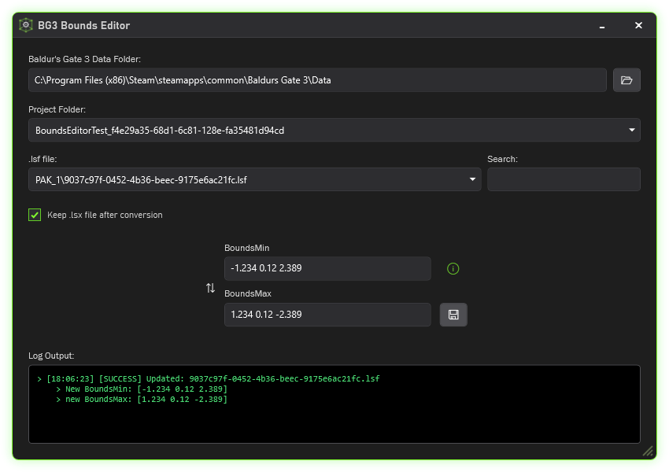

<div align="center">

  

# BG3 Bounds Editor

[](https://github.com/Py-xel/BG3-Bounds-Editor/releases)  [](https://store.steampowered.com/app/2956320/Baldurs_Gate_3_Toolkit_Data/)

</div>

A mesh bounds editor for Larian Studios’ Divinity Engine 4.0, developed for Baldur's Gate 3 mod authors.



## Features

**BG3 Bounds Editor** provides a streamlined interface for modifying mesh bounds in `.lsf` binary files. It utilizes **[LSLib](https://github.com/Norbyte/lslib)** to automatically convert a selected `.lsf` file to `.lsx`, apply the necessary changes, and then convert it back.

## Usage

The **Baldur's Gate 3 Data Folder** field requires the game's `Data` folder path.

The default data paths are:

- `C:\Program Files (x86)\Steam\steamapps\common\Baldurs Gate 3\Data` on Steam.
- `C:\Program Files (x86)\GOG Galaxy\Games\Baldurs Gate 3\Data` on GOG.

The **Project Folder** lists all available projects, excluding those created by **[Larian Studios](https://larian.com)**.

The **.lsf file** dropdown then lists all `.lsf` files found within the following path:

`<DataPath>\Public\<YOURMOD>\Content\`

> [!CAUTION]
> Any `.lsf` file that is not located in that directory is considered invalid and **will NOT be displayed**!
>
> Non-mesh `.lsf` files, such as VisualEffects, are not convertible!

---

By default, the bounds attributes of an `.lsx` file look like this:

```xml
<attribute id="BoundsMin" type="fvec3" value="-1.234 0.12 2.389" />
<attribute id="BoundsMax" type="fvec3" value="1.234 0.12 -2.389" />
```

The values are space-separated and use a dot as the decimal separator. The `BoundsMin` and `BoundsMax` fields in the editor must follow these same rules.

Additionally, the following two files are created:

| File          | Description                                                                                                                          |
| :------------ | :----------------------------------------------------------------------------------------------------------------------------------- |
| `config.json` | Stores the currently selected `DataPath`, `ProjectPath`, `lsxPreservation`, and `SwappedFields` values, which are loaded on startup. |
| `log.txt`     | Stores all log data.                                                                                                                 |

## Requirements

| Dependency  | Link                                                                                  |
| :---------- | :------------------------------------------------------------------------------------ |
| `.NET 8.0+` | https://builds.dotnet.microsoft.com/dotnet/Sdk/8.0.418/dotnet-sdk-8.0.418-win-x64.exe |

## Installation & Build

You can download the latest release **[here](https://github.com/Py-xel/BG3-Bounds-Editor/releases)** or build the project by cloning the repository:

```bash
git clone https://github.com/Py-xel/BG3-Bounds-Editor.git
```
